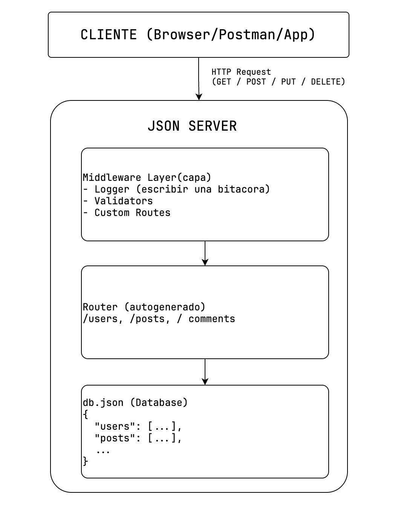

# Sesion 03

- no se olviden sincronizar el repositorio del profesor y hacer un `git pull`
- despues ejecutar `npm install`

## Spread Operator

- Entender qué es este operador
- Comprender la diferencia entre una copia superficial y otra a mayor detalle
- Identificar cuando usar spread
- Aplicar spread

Permite **expandir** elementos iterables(arrays, string, objetos) para poder obtener su valor de una forma más fácil.


ejecucion:  `nx serve es6`

ejemplo basico de spread:

```js
const numerosOriginales = [1, 2, 3]; // numeros originales
console.log("numeros originales", numerosOriginales);
```

## Promises (promesas)

- Explicar que es un promise
- Identificar cuando se usa
- Comprender como es el flujo de una promesa

Una promesa(promise) es un objeto que REPRESENTA el resultado de una operación **ASÍNCRONA**, es como la notificación de compra en un ecommerce, o la respuesta de una entidad a tu solicitud, etc, etc.

- Eventos **Síncronos**: eventos bloqueantes, que se deben solucionar en ese momento.
- Eventos **asíncrono**: eventos NO bloqueantes, pueden esperar y su respuesta se dá en el momento en el que se resuelva.


## API Rest json-server

JSON Server es una herramienta que te permite crear una **API REST completa en poco tiempo** sin escribir código del servidor. Es perfecta para estos escenarios

- Prototipos rápidos
- Testing de aplicaciones
- Aprendizaje de API REST
- Demos y presentaciones

 imagina que necesitas una tienda de verdad para probar tu sistema de pagos JSON server es como una **tienda de cartón** completamente funcional no es real pero puedes hacer todas las operaciones como si lo fuera.



### Estructura del proyecto

```plain
.
└── api/
    ├── data/
    │   └── db.json (aquí declaras tu Base de datos)
    ├── middlewares/
    │   ├── logger.js
    │   └── validator.js
    ├── server.js
    ├── package.json
    └── README.md
```

### Instalacion

```bash
# instala json-server

npm install --global json-server
#  o en forma local
npm install --save-dev json-server
```

### json-server en forma global

```bash
npm install --global json-server

# y lo ejecutamos
json-server apps/api/data/db.json --port 4001 
```
