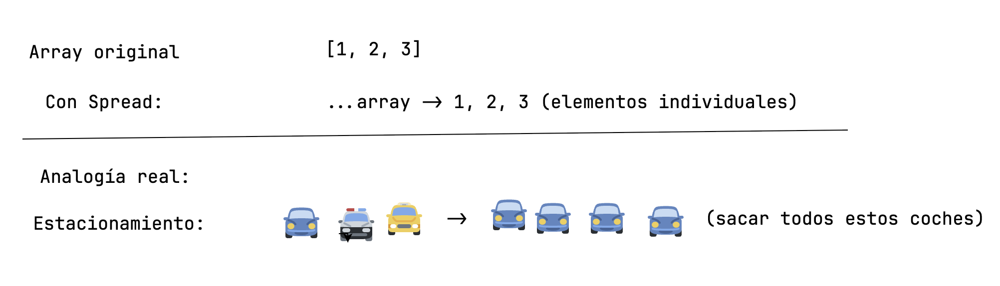
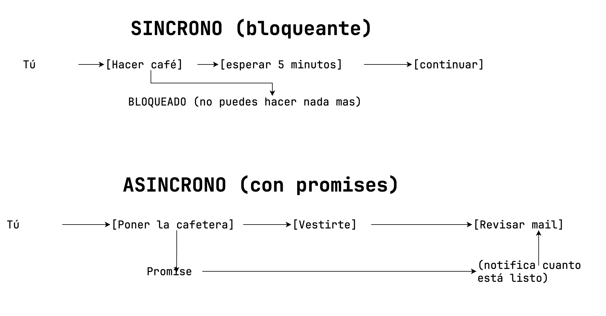
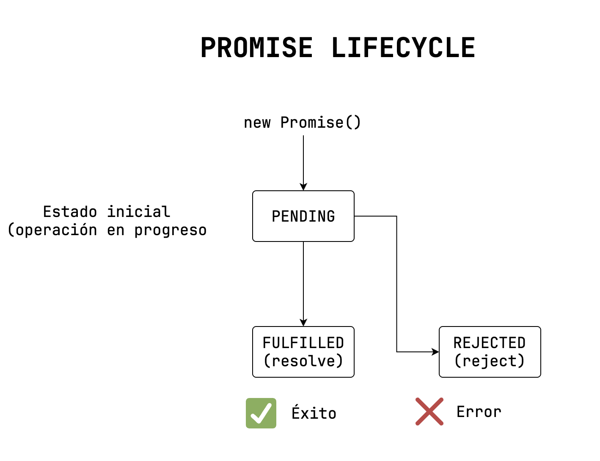

# Sesion 03

- no se olviden sincronizar el repositorio del profesor y hacer un `git pull`
- despues ejecutar `npm install`

## Spread Operator

- Entender qué es este operador
- Comprender la diferencia entre una copia superficial y otra a mayor detalle
- Identificar cuando usar spread
- Aplicar spread

Permite **expandir** elementos iterables(arrays, string, objetos) para poder obtener su valor de una forma más fácil.



ejecucion:  `nx serve es6`

ejemplo basico de spread:

```js
const numerosOriginales = [1, 2, 3]; // numeros originales
console.log("numeros originales", numerosOriginales);
```

## Promises (promesas)

- Explicar que es un promise
- Identificar cuando se usa
- Comprender como es el flujo de una promesa

Una promesa(promise) es un objeto que REPRESENTA el resultado de una operación **ASÍNCRONA**, es como la notificación de compra en un ecommerce, o la respuesta de una entidad a tu solicitud, etc, etc.

- Eventos **Síncronos**: eventos bloqueantes, que se deben solucionar en ese momento.
- Eventos **asíncrono**: eventos NO bloqueantes, pueden esperar y su respuesta se dá en el momento en el que se resuelva.





## API Rest json-server
