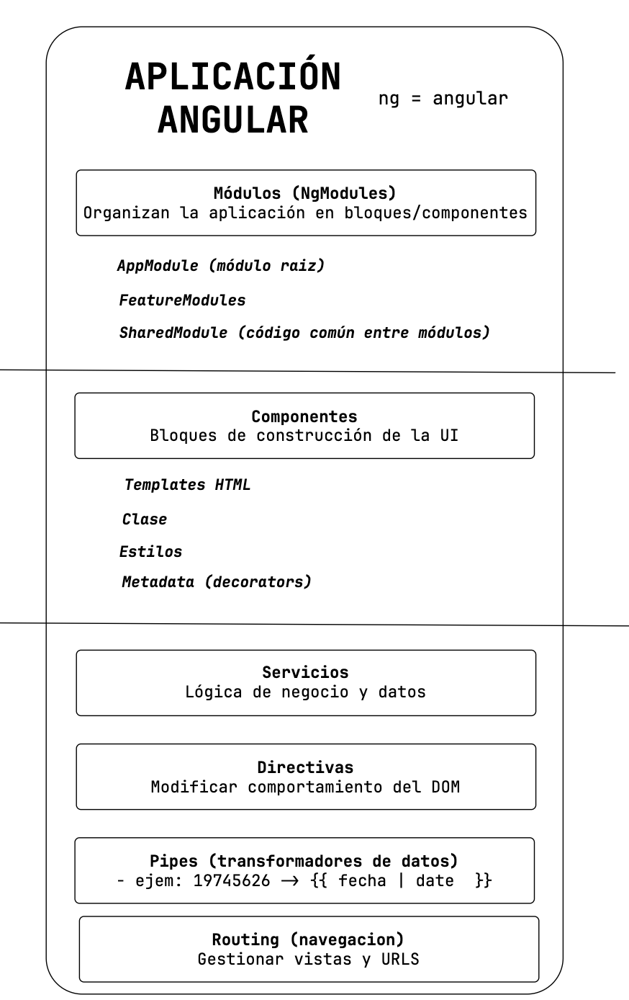

# Sesion04

## Angular - introducción y primeros pasos

**Angular** es un framework de desarrollo Frontend basado en **Typescript** y es creado y mantenido por Google, que proporciona una arquitectura completa para construir aplicaciones web de una sola página (SPA - Single Page Application -> index.html) y esto lo logra a traves de un sistema de Componentes **declarativos** y **reutilizables**.

Angular es como un "**kit de construccion profesional**" para aplicaciones web, te dá todas las herrmaientas, reglas y estructuras necesarias para construir aplicaciones complejas de manera organizada y predecible.

### Analogía del mundo real

```plain
.
└── Aplicacion  Web Tradicional = Construir una casa sin planos/
    ├── Cada desarrollador construye a su manera
    ├── Sin estructura estandar
    ├── Dificil de mantener
    └── Complejo de escalar
```

```plain
.
└── Angular = Sistema de construcción modular/
    ├── Planos estandarizados (arquitectura)
    ├── Módulos prefabricados (componentes)
    ├── Inspección (TypeScript)
    └── Mejores prácticas
```

### Que problema resuelve Angular?

> Problemas de desarrollo web tradicional

1. Caos de código
   - index.html (~500-600 lineas mezcladas, css, html, js)
   - HTML mezclado con JS
   - Colisión de CSS (método de cascada)
   - Dificil de leer / mantener
2. Manipulación manual del DOM (Document Object Model -> la interpretación de las etiquetas (HTML) en forma de arbol )
  html -> head/title/body->h1/p/table
3. Sin estructura
4. Sin reutilización
   - ejemplo: una validación de correo electronico
5. Testing Imposible

> Soluciones que aporta Angular

1. Separación de responsabilidades
   - component.ts --->   lógica
   - component.html ---> Estructura
   - component.css ---> Estilos
   - component.spec.ts ---> Test

2. Componentes reactivos
   - El framework **detecta cambios** automáticamente.

```ts
// logica del componente
// ...
this.users =[...];
// angular vá a actualizar el DOM al detectar cualquier cambio de este atributo
```

3. Reutilización total de componentes

```html
<user-card [user]="userData" ></user-card>
<user-card [user]="userData2" ></user-card>
<!-- este componente lo puedo REUTILZIAR en múltiples lugares -->
```

4. Testing Integrado

   - Cada componente es testeable independientemente.

### Arquitectura de Angular (Vista conceptual):



### Cuando usar angular?

- Aplicacion empresarial compleja
  - Múltiples características / módulos
  - Equipos grandes
  - Necesidad de estructura rígida
  - Sistema ERP, CRM
- Proyectos de larga duración
  - Mantenimiento por anios
  - Multiples desarrolladores rotando
  - Necesidad de convenciones estrictas
- Aplicaciones con mucha lógica de negocio
  - Plataformas financieras

### Cuando NO usar Angular?

- Sitios web estático / Simple
  - ovehead innecesario
  - Mejor: HTML / CSS o generadores estáticos
- Proyectos muy pequenos
  - Pocas funcionalidades
  - Vanilla JS (javascript puto) o micro-frameworks (preactjs, vue, infernojs, etc)
- Equipo sin experiencia en TS / POO
  - Curva de aprendizaje es más pronunciada
  - Considera frameworks más simples
- Máximo rendimiento inicial
  - Bundle size grande (tamano del proyecto en kb)

### Comparativa conceptual

| **Aspecto**   | **Angular**        | **React**              | **Vue**              |
| ------------- | ------------------ | ---------------------- | -------------------- |
| Filosofia     | Framework completo | Biblioteca UI          | Framework progresivo |
| Lenguaje      | Typescript         | JS / JSX TS(opcional)  | JS / TS              |
| Curva         | **Pronunciada**    | Moderada (+ecosistema) | Suave (progresivo)   |
| Opinión       | Muy opinionado     | Flexible (tu decides)  | Balanceada           |
| Tamano Bundle | ~500KB             | ~100KB + librerias     | ~80KB (core)         |
| Ideal para:   | Empresas grandes   | Flexible / Ecosistema  | Proyectos medianos   |

## Primeros pasos

```bash
npm install -g @angular/cli
# validar la instalación
ng --version

# crear un nuevo proyecto
ng new angular-first --routing --dry-run

# ejecutar el proyecto
ng serve --open --verbose --host 0.0.0.0

# Crear un nuevo componente
ng generate component first-component --inline-style --prefix work --style scss --dry-run
```

## TypeScript

- Interfaces
- Funciones
- Tipado de valores primitivos
- Parametros Opcionales
- Clases y Decoradores

## Glosario

- CLI -> Command Language Interface
